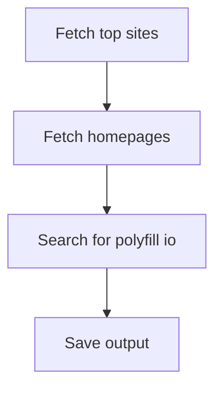
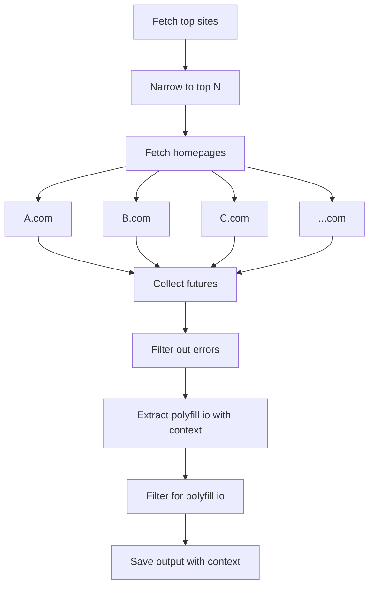

Since the recent sale of the polyfill io domain, over a hundred thousand websites became vulnerable to supply chain attacks capable of injecting arbitrary JavaScript onto a webpage. It was a massive attack that could have been much worse if the attackers were more competent. You can learn more about it in [coverage from The Register](https://www.theregister.com/2024/06/28/polyfillio_cloudflare_malware/) or [Theo (t3.gg)’s video](https://youtu.be/ILvNG1STUZU?si=0essgw8EMslUFfex).

In Theo’s video, I was surprised that a number of high-profile sites were still using polyfill, including Hulu at the time of his making the video. Fortunately, Cloudflare was the registrar for the domain and quickly blocked it to prevent further attacks. Still, it got me wondering who is still using polyfill io on their sites.

If this is news to you and you’re a web developer who manages a site in production, stop what you’re doing right now and make sure you’re not using polyfill io. Then come back here and chuckle imperiously at the unfortunates who have not.

## Writing a Data Pipeline

Because I’m a huge nerd, I decided to take a stab at scanning the internet for sites still using polyfill io. I figured I’d keep it simple and limit my search to just the most popular websites. This is just a proof of concept, and there’s a lot more to be done before I would consider this reliable. Still, I think my process and initial results were interesting. You can see the source code along with a few result datasets [on my GitHub](https://github.com/AlexanderOtavka/polyfill-io-scanner/tree/main).

### Design

Calling this script a “data pipeline” may seem like dressing up a simple idea in fancy language. That’s true, but it also describes the overall design and the way I thought about this problem. A data pipeline is just a design pattern where a dataset goes through a sequence of transformations to get to a final result. Data pipelines are easier to work with if we can get as close to a linear flow as possible with minimal nesting.

When I approached this problem, I had just a few simple steps in mind. I didn’t actually draw this diagram until after, but that can be a helpful design step to make sure your data flow is clear.



### Fetching Top Sites

For the initial dataset of top websites, I decided to use the list compiled by the Google Chrome UX team (CrUX). They publish a dataset of top sites ranked by the most frequent user-initiated page loads in Chrome. The dataset is conveniently available in CSV form thanks to [Zakir Durumeric](https://github.com/zakird) and his [crux-top-lists GitHub repo](https://github.com/zakird/crux-top-lists).

The irony of pulling data from untrusted GitHub repos while investigating a supply chain attack is not lost on me. If this pipeline gets [gzip bombed](https://en.wikipedia.org/wiki/Zip_bomb), I deserve it. But it’s not running in production and only unzips into memory, so I think we are fine.

To prevent a re-download on every rerun of the pipeline, I cache the `.csv.tar.gz` file after the first download. This was just a quick optimization since the re-download was slowing down my dev workflow.

### Fetching Homepages

Websites are more than just their homepage, but I decided that further crawling would be too slow and complex. Also, the way polyfill was supposed to be used, most web developers would include it on every page to ensure a consistent experience. Scanning homepages may miss some sites, but that’s fine for our purposes.

If you were paying close attention, you may have noticed that the `Fetch homepages` step is covering up some nesting. For each row in our top sites, we have to make a web request to grab the HTML. If we were to do this in a straightforward `for` loop or a dataframe `apply`, our pipeline would take far too long to finish, even for a fairly small number of requests.

Most of the time spent on this step is just waiting for a network response, so running our requests in a thread pool can give us the performance we want without the overhead of some other concurrency models. To simplify the concurrency model, we don’t mutate any shared data structures from our threads. We simply return the homepage content as a string and aggregate it back into our dataframe as we collect the results of the futures. Python’s `concurrent.futures.as_completed()` is very helpful for this sort of thing.

Lastly, we can wrap our future collection with `tqdm` for a nice, pretty progress bar. This can be very helpful in making sure our pipeline isn’t hanging.

I’m including the code for reference, since this is a common pattern I find myself using when performing web requests with dataframes.

```python
def fetch_homepages_in_parallel(max_rank_sites: pd.DataFrame):
    """
    Fetch the homepages of a list of URLs in parallel.
    """
    # Use ThreadPoolExecutor to fetch homepages in parallel
    with ThreadPoolExecutor(max_workers=20) as executor:
        # Submit all fetch tasks and create a dictionary of future to url
        future_to_url = {
            executor.submit(fetch_homepage_content, url, timeout=10): url
            for url in max_rank_sites["origin"]
        }

        # Collect results as they complete
        for future in tqdm(
            as_completed(future_to_url),
            desc="Fetching homepages",
            total=len(future_to_url),
        ):
            url = future_to_url[future]
            try:
                content = future.result()
                # Assign the result back to the DataFrame
                max_rank_sites.loc[
                    max_rank_sites["origin"] == url, "homepage_content"
                ] = content
            except Exception as e:
                logging.error(f"Error fetching content for {url}: {e}")
```

### Searching for Polyfill io

This part was pretty easy. None of the homepage contents were large enough that a simple string contains wouldn’t give us the right answer. The main drawback of a string contains check is that it misses out on the important context of what the code is actually doing. For example, we may be in a comment, not a script tag.

We could parse the HTML with something like [Beautiful Soup](https://beautiful-soup-4.readthedocs.io/en/latest/) to only check for script tags. That approach is more work and may exclude sites that include polyfill in unexpected ways. Instead, I decided to just modify my filter to include the surrounding context of each occurrence so I could manually look through and see what triggered the match. I could always narrow the filter further if there were too many false positives.

### Saving Output

Saving the output was pretty straightforward. I decided to just dump the origin and the match context to a CSV file. I embedded a timestamp in the filename so I could rerun the pipeline and track historical changes.

### Final Implementation

After all the fixes and improvements, my final implementation ended up looking more like this.



## The Results

I didn’t recognize most of the results, but there were a few big names still using polyfill as of June 30th. Among them, [weather.com](https://weather.com/), [foxsports.com.mx](https://www.foxsports.com.mx/), and [breitbart.com](https://www.breitbart.com/) stand out. I guess nationalist news media’s incident response is pretty slow in the case of Breitbart.

The results also included some false positives like [netflix.com](https://www.netflix.com/) and [theguardian.com](https://www.theguardian.com/), which just included polyfill in comments. These could be false false positives though since the script just gives context for the first occurrence, and it’s possible they include polyfill further down.

## Future Improvements

I’ve alluded to a few throughout this post, but I’ll give my top three here.

1. **Historical scanning via archive.org**: It might be interesting to see how many sites have polyfill over time. I’m a little late to this party, so many sites have probably already responded to the incident. A historical dataset might produce some interesting graphs after the news blew up as developers and infrastructure companies like Cloudflare reacted.
2. **Proper HTML parsing**: The current script generates a lot of false positives with commented out code and other weirdness. Running an HTML parser and scanning the DOM would likely give more reliable results.
3. **Casting a wider net**: To save time, I’ve only scanned the top 5k sites so far. The dataset from Google includes a million sites, and I’d be curious to see what wider trends we see by expanding the search.
