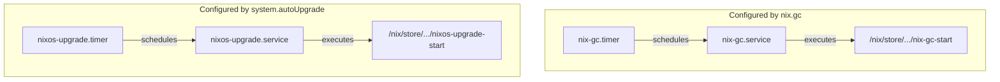

Any internet-connected system should be kept up-to-date for security.  In this post, I’ll discuss a simple way to keep your [NixOS](https://nixos.org) machine up-to date.  If you’re new to Nix and NixOS, [you can get started here](https://nixos.org/learn/), and come back to this post when you have it installed and running on your system.

For the impatient, here’s ten lines of boilerplate to add to your `configuration.nix`.  The rest of this post will explain what they do, why you need them, and some potential drawbacks.

```nix
# Automatically install system updates daily
system.autoUpgrade = {
  enable = true;
  allowReboot = true;
  dates = "11:00"; # UTC = 4am PDT / 3am PST
};

# Run garbage collection on a weekly basis to avoid filling up disk
nix.gc = {
  automatic = true;
  dates = "weekly";
  options = "--delete-older-than 30d";
};
```

See also the nix wiki page on [automatic system upgrades](https://nixos.wiki/wiki/Automatic_system_upgrades) and [storage optimization](https://nixos.wiki/wiki/Storage_optimization).

## Why Run Automatic Updates?

The main reason you should keep software up-to-date is to prevent easy hacks.  Any system connected to the internet is vulnerable to these sorts of attacks.  Threats on the internet are constant and automated.  An attacker doesn’t need to specifically target you for you to be at risk.  Out-of-date software is one of the most common causes of data breaches according to [one study](https://www.servicenow.com/lpayr/ponemon-vulnerability-survey.html?cid=s:servicematters:12672).  Enabling automatic updates is an easy way to minimize this risk.

> **An attacker doesn’t need to specifically target you for you to be at risk.**
>

While we can always manually update our systems, it’s annoying, easy to forget, and gives attackers a larger window to exploit out of date software.

Software updates can also fix bugs, improve performance, and add new features.  By enabling automatic updates, we get these benefits too.

## Enabling Automatic Updates

```nix
# Automatically install system updates daily
system.autoUpgrade = {
  enable = true;
  allowReboot = true;
  dates = "11:00"; # UTC = 4am PDT / 3am PST
};
```

The first config block enables automatic updates, schedules them to run nightly, and allows system reboots if needed.  We schedule the updates to happen at off hours to prevent a reboot from disrupting our system while we are using it.  If you would prefer to manually run reboots, you can always set `allowReboot = false`, but risk missing important updates that cannot be applied without a reboot.

Add this code to your `configuration.nix`.  Don’t forget to run `sudo nixos-rebuild switch` to switch your system to the new configuration.

In effect, we are just scheduling the command `sudo nixos-rebuild switch --upgrade` and if required, `sudo shutdown -r 1`.  This will pull the latest packages from our configured `nixos` [channel](https://nixos.wiki/wiki/Nix_channels) and rebuild our system, rebooting if necessary.

You can read more about [automatic updates](https://nixos.wiki/wiki/Automatic_system_upgrades) on the NixOS wiki.

## Nix Garbage Collection

```nix
# Run garbage collection on a weekly basis to avoid filling up disk
nix.gc = {
  automatic = true;
  dates = "weekly";
  options = "--delete-older-than 30d";
};
```

The second code block solves a problem introduced by the first.  Every time we run `nixos-rebuild`, we create a new [generation](https://nixos.wiki/wiki/Overview_of_the_NixOS_Linux_distribution#Generations) of our system.  This is usually a good thing since it lets us rollback to an older working state if the updates break something, but it can sometimes be a problem if a system is left unattended.

Each generation is stored on disc all the outdated package versions it uses, and that can fill up our storage over time.  Nix has a built in mechanism to “collect garbage” that is no longer needed.  We can manually trigger this collection, and optionally set an age limit to keep recent generations in case we need to do a rollback.

```bash
sudo nix-collect-garbage --delete-older-than 30d
```

The `nix.gc` configuration just schedules this collection in much the same way as `system.autoUpgrade` so we don’t have to worry about it.

You can read more about [automatic garbage collection](https://nixos.wiki/wiki/Storage_optimization#Automation) on the NixOS wiki.

## Limitations and Pitfalls

**Updates sometime require system restarts**.  Depending on your system availability needs, this could be a problem.  Scheduling the updates to happen at a time of low utilization can help, but you can also set `system.autoUpgrade.allowReboot = false;` and reboot manually during scheduled maintenance.

**Updates can break existing software**, especially if using an unstable [channel](https://nixos.wiki/wiki/Nix_channels).  Using a stable channel makes this less likely, but introduces a manual step where you may need to switch to a new channel when your current channel reaches end of life.  Consider the trade offs and choose a channel that is right for your needs.

**NixOS updates only update the current nix channel**, which may not include all software installed on a system.  Be sure you pay attention to how software is installed on your system.  In general, configuration referencing `<nixpkgs>` should update fine, but [flakes](https://nixos.wiki/wiki/Flakes) or custom derivations may need extra attention.

## Under the Hood

That’s all you really need to know, but if you’re curious, we can peek under the hood at what is actually happening.  It may be helpful to read up on [systemd](https://en.wikipedia.org/wiki/Systemd) to understand what is going on here.  At a high level, each of our config blocks declare a systemd timer, a service, and a script that work together to schedule automatic updates.



We can inspect these components on a running system.  I’ll detail the process for `nixos-upgrade`, but you could follow the same steps for `nix-gc`.

### Timer

First, we inspect `nixos-upgrade.timer` to see how upgrades are scheduled.  This shows us details about when our next upgrade will be run.

```
$ sudo systemctl status nixos-upgrade.timer
● nixos-upgrade.timer
     Loaded: loaded (/etc/systemd/system/nixos-upgrade.timer; enabled; preset: >
     Active: active (waiting) since Thu 2024-07-04 11:02:00 UTC; 4 days ago
    Trigger: Tue 2024-07-09 11:00:00 UTC; 13h left
   Triggers: ● nixos-upgrade.service
```

### Service

Notice the line `Triggers: ● nixos-upgrade.service`.  Let’s take a look at the service that actually does the updates.  If you have only just enabled auto updates, you can trigger the service manually.  It may schedule a reboot.

```
sudo systemctl start nixos-upgrade.service
```

Then, inspect the logs with `journalctl`.

```
$ sudo journalctl -u nixos-upgrade.service
Jul 08 21:54:57 kingpin systemd[1]: Starting NixOS Upgrade...
Jul 08 21:54:59 kingpin nixos-upgrade-start[1540]: unpacking channels...
Jul 08 21:55:14 kingpin nixos-upgrade-start[1561]: this derivation will be built:
Jul 08 21:55:14 kingpin nixos-upgrade-start[1561]:   /nix/store/lnm48hkq64m5sbzf370kmp8q78rh0lzf-nixos-rebuild.drv
Jul 08 21:55:14 kingpin nixos-upgrade-start[1561]: these 144 paths will be fetched (53.10 MiB download, 242.93 MiB unpacked):
...
Jul 08 21:56:46 kingpin shutdown[14389]: Reboot scheduled for Mon 2024-07-08 21:57:46 UTC, use 'shutdown -c' to cancel.
Jul 08 21:56:46 kingpin systemd[1]: nixos-upgrade.service: Deactivated successfully.
Jul 08 21:56:46 kingpin systemd[1]: Finished NixOS Upgrade.
Jul 08 21:56:46 kingpin systemd[1]: nixos-upgrade.service: Consumed 4min 28.426s CPU time, received 1.4G IP traffic, sent 5.8M IP traffic.
```

### Script

To drill deeper and read the code, inspect the contents of the systemd unit file with `systemctl cat`.

```
$ sudo systemctl cat nixos-upgrade.service
# /etc/systemd/system/nixos-upgrade.service
[Unit]
After=network-online.target
Description=NixOS Upgrade
Wants=network-online.target
X-StopOnRemoval=false

[Service]
Environment="HOME=/root"
Environment="LOCALE_ARCHIVE=/nix/store/zshzrwn4zc9132jyz9xp11jr9agb4aqk-glibc-locales-2.39-52/lib/locale/locale-archive"
Environment="NIX_PATH=nixpkgs=/nix/var/nix/profiles/per-user/root/channels/nixos:nixos-config=/etc/nixos/configuration.nix:/nix/>
Environment="PATH=/nix/store/dhv5gh89him9a7ddr56cqg87zfkmjihp-coreutils-9.5/bin:/nix/store/0a0khkw34v25q8k6p44ma1rqa479r1za-gnut>
Environment="TZDIR=/nix/store/k6vxnriwl3ywpmlmvif3zr418j7dwm1n-tzdata-2024a/share/zoneinfo"
X-RestartIfChanged=false
ExecStart=/nix/store/7a26xdlgbvp9jrkvks2p77a3xabz02yy-unit-script-nixos-upgrade-start/bin/nixos-upgrade-start
Type=oneshot
```

Notice the `ExecStart=` line in the `[Service]` section.  This points to the script that actually gets executed.  We can `cat` out the contents to see what is happening.  I’ve abbreviated the nix store hashes with `xx` here for readability.

```bash
$ sudo cat /nix/store/xx-unit-script-nixos-upgrade-start/bin/nixos-upgrade-start
#!/nix/store/xx-bash-5.2p26/bin/bash
set -e
/nix/store/xx-nixos-rebuild/bin/nixos-rebuild boot --no-build-output --upgrade
booted="$(/nix/store/xx-coreutils-9.5/bin/readlink /run/booted-system/{initrd,kernel,kernel-modules})"
built="$(/nix/store/xx-coreutils-9.5/bin/readlink /nix/var/nix/profiles/system/{initrd,kernel,kernel-modules})"

if [ "${booted}" = "${built}" ]; then
  /nix/store/xx-nixos-rebuild/bin/nixos-rebuild switch --no-build-output
else
  /nix/store/xx-systemd-255.6/bin/shutdown -r +1
fi
```

At the end of the day, it’s a pretty simple script that gets generated from our configuration.  There’s a bit of logic to decide if we should reboot, but otherwise just a oneliner.
